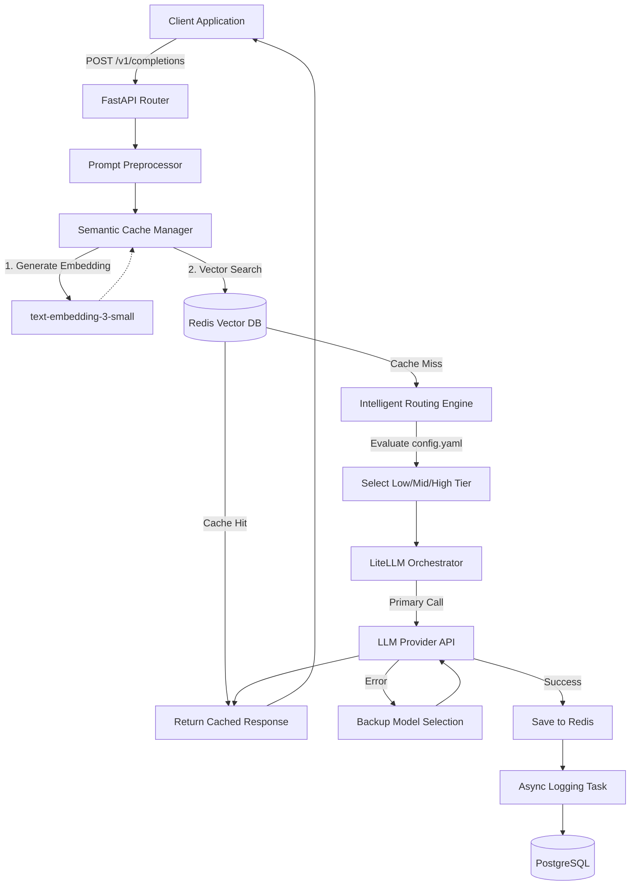

# Architecture overview

## Data Flow Diagram

## Routing Heuristics
The gateway evaluates prompts using rules defined in `config.yaml`:
1. **Keyword Analysis**: Prompts containing complex tasks (`analyze`, `architect`) are aggressively routed to high-tier models. This ensures high-reasoning tasks get the best intelligence.
2. **Token Length**: Longer prompts (e.g., > 1000 tokens) are routed to mid-tier models with larger context windows to prevent overwhelming the low-tier models while avoiding the high costs of high-tier models for basic summarization.
3. **Catch-All**: Everything else defaults to a fast, low-tier model (e.g., Groq Llama 3) for maximum cost savings.

## Vector Caching Strategy
- We utilize `text-embedding-3-small` to generate a 1536-dimensional vector for each incoming prompt.
- **Redis (RediSearch)** is used as an in-memory vector database using the `FLAT` indexing method and `COSINE` distance metric.
- **Cosine Similarity** measures the angle between two vectors. A high similarity score (e.g., > 0.95) indicates the semantic meaning of two prompts is nearly identical, even if the exact wording differs. This allows us to serve the cached answer for variations like "How do I reset my password?" and "What is the password reset process?".
